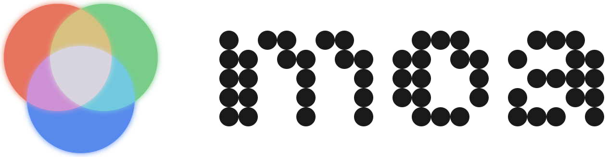

<p align="center">
  
</p>

<p align="center">
  <a href="https://github.com/pietz/moa-cli/actions/workflows/ci.yml"></a>
</p>

# MOA - Mixture of Agents

Ask one question to multiple local AI coding CLIs **in parallel** and collect their answers. MOA detects which agent CLIs you have installed (Claude Code, Codex, agy, opencode), fans your prompt out to them, and streams each answer back the moment that agent finishes. Optionally, it can synthesize the answers into a single unified response.

It's a drop-in, batteries-included replacement for hand-rolling parallel `claude -p` / `codex exec` / `opencode run` calls (or a "peer review" agent skill): one command, clean attributed output, made to be called by a human **or** by another agent.

The package is named `moa-cli` but installs the command `moa`.

```bash
uv tool install moa-cli
moa ask "Is Postgres or SQLite better for a desktop app?"
```

Or run it once without installing:

```bash
uvx --from moa-cli moa ask "Review this plan."
```

## Why

A single model gives you one perspective. Asking three frontier models the same question - and seeing where they agree, diverge, or contradict - is a fast, cheap way to pressure-test an answer. MOA makes that a one-liner using the CLIs you already pay for, with no API keys of its own.

## Usage

```bash
moa doctor                                  # show installed CLIs and their default models
moa ask "Should this feature use SQLite?"   # ask the top 3 installed agents (read-only)
moa ask -n 2 "..."                          # ask only the top 2 (priority order)
moa ask -p claude -p agy "..."              # pin specific agents
moa ask -x claude "..."                     # drop an agent (e.g. exclude the caller's own model)
moa ask -m claude=sonnet "..."              # override which model a tool uses
moa ask --yolo "..."                        # grant full write access (default is read-only)
moa ask --synth "..."                       # also merge the answers into one
moa ask --json "..."                        # machine-readable JSONL (for agents/pipes)
git diff | moa ask -f - "Review this diff." # read the prompt from stdin
```

### Read-only by default

MOA is built to be called autonomously, so by default **no agent can write files or
run mutating commands**. Each agent runs in its tool's safest mode: it may read local
files (and, where the tool allows, research online), but it cannot edit anything. This
is enforced by spawning each CLI with its own read-only flags:

| Provider   | Read-only (default)        | Reads files | Web research              |
| ---------- | -------------------------- | ----------- | ------------------------- |
| `claude`   | `--permission-mode plan`   | yes         | yes                       |
| `codex`    | `-s read-only`             | yes         | **no** (sandbox blocks network) |
| `opencode` | `--agent plan`             | yes         | yes                       |
| `agy`      | none (runs unsandboxed)    | yes         | yes                       |

`codex`'s read-only mode is a kernel sandbox that also blocks network, so codex does no
web research in the default mode (it still reads local files). `agy` has **no read-only
mode** that stops its file-writing tools, so it runs **unscoped** (it can write) even in the
default mode. It still stays in the panel; the selection note on stderr flags that `agy`
runs unsandboxed so you know.

### `--yolo` (full write access)

Pass `--yolo` to grant every agent full write access (file edits and shell commands,
auto-approved). Use it only when you actually want the agents to change your working tree.

```bash
moa ask --yolo "Refactor this module and run the tests."
```

Under `--yolo` every agent (including `agy`) gets full write access. In the default mode,
`agy` still runs because it has no read-only mode to apply: it runs unscoped, and MOA notes
that on stderr.

### How agents are selected

`-n/--num` (default 3) picks the first N **installed** agents from a popularity-ordered priority list:

```
claude  ->  codex  ->  agy  ->  opencode
```

So `moa ask -n 3` on a machine with all four installed asks Claude, Codex, and agy (opencode is #4). `agy` has no read-only mode, so it runs unscoped (unsandboxed) and MOA flags that with a note on stderr; it is **not** excluded. Use `-p/--provider` (repeatable) to pin an exact set and ignore `-n`.

Use `-x/--exclude` (repeatable) to drop one or more agents from the run. Exclusion is applied *before* `-n` takes the first N, and it also drops excluded names from an explicit `-p` set. It is off by default. The motivating case: an agent (e.g. Claude Code) calls `moa` for *other* opinions; `moa ask -x claude` makes sure one "peer" isn't just the caller's own model. So `moa ask -n 3 -x claude` asks Codex, agy, and opencode.

### Choosing models

Each tool ships with a reasonable default model, but you can override which model any tool uses with `-m/--model PROVIDER=MODEL` (repeatable). Only the providers you name change; the rest keep their defaults.

```bash
moa ask -m claude=sonnet -m agy="Gemini 3.1 Pro (Low)" "..."
```

The model-string format differs per tool and is passed through verbatim (the tool's own CLI validates it):

| Provider   | Default                 | `-m` format                                            |
| ---------- | ----------------------- | ------------------------------------------------------ |
| `claude`   | `opus`                  | short id, e.g. `claude=sonnet`                         |
| `codex`    | `gpt-5.5`               | model id, e.g. `codex=gpt-5.5`                         |
| `agy`      | `Gemini 3.1 Pro (High)` | exact display name, e.g. `agy="Gemini 3.1 Pro (Low)"`  |
| `opencode` | (tool's authed default) | `provider/model` slug, e.g. `opencode=anthropic/claude-sonnet-4` |

`opencode` has no built-in default; without an override it omits `-m` and lets opencode pick. Pass `-m opencode=provider/model` to pin one.

### Output

- **stdout** carries only content: each agent's answer as a Markdown block (`## claude (opus) - OK - 3.5s`), flushed the instant that agent finishes, then the synthesis block if `--synth` is set.
- **stderr** carries progress and selection notes (`Asking claude, codex ...`), so piping stdout stays clean.
- `--json` emits one JSON object per line (JSONL): a `{"type": "response", ...}` record per agent as it completes, then a `{"type": "synthesis", ...}` record. Ideal when another agent calls MOA and parses the result.

### Synthesis

`--synth` runs one more pass that merges the collected answers into a single, unified answer. The synthesizer is chosen with `--synthesizer`:

- `auto` (default) - the highest-priority agent that ran (deterministic)
- `random` - pick one of the agents that ran, at random
- a provider name (`claude`, `codex`, `agy`, `opencode`)

### Attribution policy

The human (or agent) reading MOA's output **always gets correct attribution**: every response block shows the real provider name. There is no human-facing anonymization toggle.

The synthesizer is a different story. To stop it picking favourites by brand, it **always** receives the proposer answers anonymized as "Response A / B / C" and order-shuffled. This is always-on internal behaviour, not a flag. The synthesized answer itself is brand-agnostic prose, and the A/B/C labels never leak into stdout, stderr, or the JSON.

## Supported agents

Invocations below show the default (read-only) flags; `--yolo` swaps in each tool's full-access mode.

| Provider    | CLI        | Invocation (read-only default)                                      |
| ----------- | ---------- | ------------------------------------------------------------------- |
| `claude`    | `claude`   | `claude --model opus --permission-mode plan -p PROMPT`              |
| `codex`     | `codex`    | `codex exec -m gpt-5.5 --skip-git-repo-check -s read-only PROMPT`   |
| `agy`       | `agy`      | `agy --model "Gemini 3.1 Pro (High)" -p PROMPT` (runs unsandboxed) |
| `opencode`  | `opencode` | `opencode run --agent plan PROMPT`                                  |

Adding a new agent is a single entry in the `PROVIDERS` table in `src/moa_cli/cli.py` (executable, default model, command builder); it then participates in detection, `-n` selection, and synthesis automatically.

## Development

```bash
uv sync
uv run pytest
uv run ruff check src tests
```

MIT licensed.
